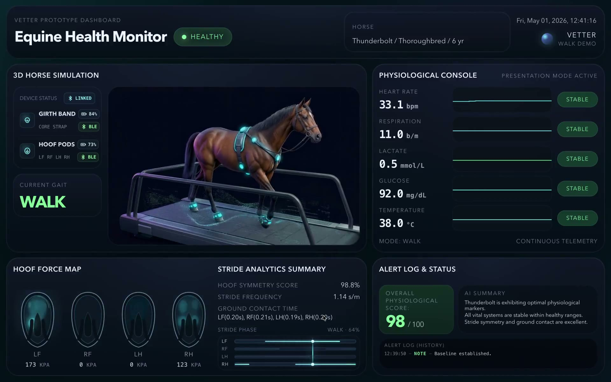

# New Venture Fair Vetter

<p align="center">
  <a href="./media/new-venture-fair-vetter-demo.mp4">
    
  </a>
</p>

<p align="center">
  <a href="./media/new-venture-fair-vetter-demo.mp4">Open the compressed demo video</a>
</p>

New Venture Fair Vetter is a polished React/Vite dashboard prototype built for the UCSB 2026 New Venture Fair. The demo presents Vetter as a live equine monitoring system: a horse-motion centerpiece, simulated vitals, hoof pressure maps, sensor status, operator controls, and alert narration designed to read clearly on a fair display.

The [New Venture Fair event page](https://innovation.ucsb.edu/events/2026-new-venture-fair) listed the 2026 fair for April 23, 2026 at 5:00 PM in Corwin Pavilion, presented by Technology Management.

## Demo Media

The original screen recording lives outside this repository at:

```text
/Users/huntae/Documents/Projects/archive/Vetter/Demo Video.mov
```

That file is 223 MB, so the README uses a compressed MP4 checked into `media/` instead:

- `media/new-venture-fair-vetter-demo.mp4`: 3.8 MB, 40.5 seconds, 1920x1202 H.264
- `media/new-venture-fair-vetter-demo-poster.jpg`: lightweight poster image for README preview

Compression command used:

```sh
ffmpeg -i "Demo Video.mov" -vf "scale='min(1920,iw)':-2" -c:v libx264 -preset slow -crf 28 -pix_fmt yuv420p -movflags +faststart -an media/new-venture-fair-vetter-demo.mp4
```

## Run Locally

```sh
npm install
npm run dev
```

Build the production bundle with:

```sh
npm run build
```

## Demo Controls

- `W`: switch to walk mode
- `G`: switch to gallop mode
- `1`: healthy walk profile
- `2`: healthy gallop profile
- `3`: mild stress profile
- `4`: recovery profile
- `F`: toggle fullscreen

## Project Notes

- The dashboard is intentionally a web app for fast fair-floor iteration and kiosk-style presentation.
- The simulation is local and deterministic enough for a controlled demo; it is not connected to live hardware.
- Horse motion assets are tracked in the repository so the app can run without external media hosting.
